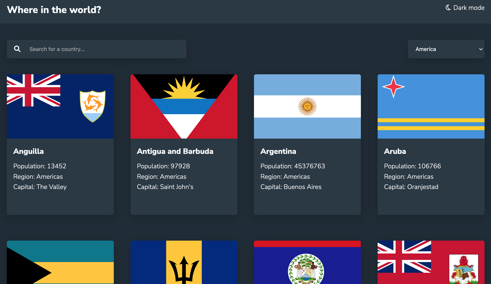

# Frontend Mentor - REST Countries API with color theme switcher solution

This is a solution to the [REST Countries API with color theme switcher challenge on Frontend Mentor](https://www.frontendmentor.io/challenges/rest-countries-api-with-color-theme-switcher-5cacc469fec04111f7b848ca). Frontend Mentor challenges help you improve your coding skills by building realistic projects. 

## Table of contents

- [Overview](#overview)
  - [The challenge](#the-challenge)
  - [Screenshot](#screenshot)
  - [Links](#links)
- [My process](#my-process)
  - [Built with](#built-with)
  - [What I learned](#what-i-learned)
- [Author](#author)
- [Acknowledgments](#acknowledgments)


## Overview

### The challenge

Users should be able to:

- See all countries from the API on the homepage
- Search for a country using an `input` field
- Filter countries by region
- Click on a country to see more detailed information on a separate page
- Click through to the border countries on the detail page
- Toggle the color scheme between light and dark mode

### Screenshot




### Links

- Solution URL: [Solution URL here](https://github.com/TamirisCss/countries-api-color-theme-switcher)
- Live Site URL: [Live site URL here](https://tamiriscss.github.io/countries-api-color-theme-switcher/)

## My process

### Built with

- Semantic HTML5 markup
- CSS custom properties
- Flexbox
- Mobile-first workflow
- Vanilla JavaScript
- [REST Countries V2 API](https://restcountries.com/#api-endpoints-v2)


### What I learned

```js
async function getCountries() {
  const response = await fetch(`https://restcountries.com/v2/all`)
  const data = await response.json();
  countries = data;
  showCountries(countries)
}
getCountries();
```


## Author

- linkedin - [Tamiris Cristine](https://www.linkedin.com/in/tamiris-cristine/)
- Frontend Mentor - [@TamirisCristine](https://www.frontendmentor.io/profile/TamirisCss)


